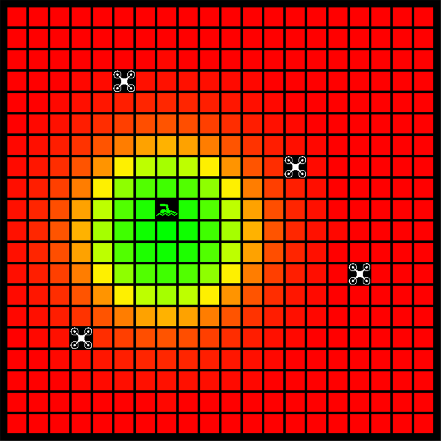

# Summary

The goal of this project is to contribute to the research of solutions that employ reinforcement learning techniques to maritime search and rescue missions of shipwrecked people. The software equip's researchers with a simulation of shipwrecked people casted away according to maritime currents to producing a stochastic environment to be used to train and evaluate autonomous agents.

# Statement of need

Maritime navigation plays a crucial role across various domains, including leisure activities and commercial fishing. However, maritime transportation is particularly significant as it accounts for 80% to 90% of global trade [@allianz]. While maritime navigation is essential for global trade, it also poses significant safety risks, as evidenced by the World Health Organization's report [@who] of approximately 236,000 annual drowning deaths worldwide. Therefore, maritime safety is essential, demanding significant enhancements in search and rescue (SAR) missions. It is imperative that SAR missions minimize the search area and maximize the chances of locating the search object.

To achieve this objective, traditional SAR operations used path planning algorithms such as parallel sweep, expanding square, and sector searches [@iamsar]. But recent researches propose a different approach to this problem using reinforcement learning techniques over pre-determined search patterns [@AI2021110098; @WU2024116403].

In order to contribute to researches on the effectiveness of integrating reinforcement learning techniques into SAR path planning, the Drone Swarm Search Environment (`DSSE`), distributed as a Python package, was designed to provide a training environment using the PettingZoo [@terry2021pettingzoo] interface. Its purpose is to facilitate the training and evaluation of single or multi-agent reinforcement learning algorithms. Additionally, it has been included as a third-party environment in the official PettingZoo documentation [@Terry_PettingZoo_Gym_for].

{ width=50% }

The environment depicted in \autoref{fig:example} comprises a grid, a probability matrix, drones, and an arbitrary number of persons-in-water (PIW). The movement of the PIW is influenced by, but not identical to, the dynamics of the probability matrix, which models the drift of sea currents impacting the PIW [@WU2023113444]. The probability matrix itself is defined using a two-dimensional Gaussian distribution, which expands over time, thus broadening the potential search area. This expansion simulates the diffusion of the PIW, approximating the zone where drones are most likely to detect them. Moreover, the environment employs a reward function that incentivizes the speed of the search, rewarding the agents for shorter successful search durations.

Using this environment, any researcher or practitioner can write code and execute an agent's training, such as the source code presented below.

```python
from DSSE import DroneSwarmSearch

env = DroneSwarmSearch()

observations, info = env.reset()
rewards = 0
done = False
while not done:
      actions = policy(observations, env.get_agents())
      observations, rewards, terminations, truncations, infos = env.step(actions) 
      done = any(terminations.values()) or any(truncations.values())
```

The package also includes a second environment option. Similar to the first, this alternative setup is designed for training agents, but with key differences in its objectives and mechanics. Unlike the first environment, which rewards agents for speed in their searches, this second option rewards agents that cover the largest area without repetition. It incorporates a trade-off by using a stationary probability matrix, but enhances the simulation with a more advanced Lagrangian particle model [@gmd-11-1405-2018] for pinpointing the PIW's position. Moreover, this environment omits the inclusion of shipwrecked individuals, focusing instead on promoting research into how agents can learn to efficiently expand their search coverage over broader areas.

The grid is divided into square cells, each representing a quadrant with sides measuring 130 meters in the real world. This correlation with real-world dimensions is crucial for developing agents capable of learning from realistic motion patterns. The drones, which are controlled by reinforcement learning algorithms, serve as these agents. During the environment's instantiation, users define the drones' nominal speeds. These drones can move both orthogonally and diagonally across the grid, and they are equipped to search each cell for the presence of the PIW.

Several works have been developed over the past few years to define better algorithms for the search and rescue of shipwrecks [@AI2021110098; @WU2024116403]. However, no environment for agent training is made available publicly. For this reason, we believe that the development and provision of this environment as a Python library and open-source project will be relevant to the machine learning community and ocean safety.

This new library makes it possible to implement and evaluate new reinforcement learning algorithms, such as Deep Q-Networks (DQN) [@dqn2015] and Proximal Policy Optimization (PPO) [@ppo2017], with little effort. An earlier iteration of this software was utilized in research that compared the Reinforce algorithm with the parallel sweep path planning algorithm [@dsse2023].

# References
